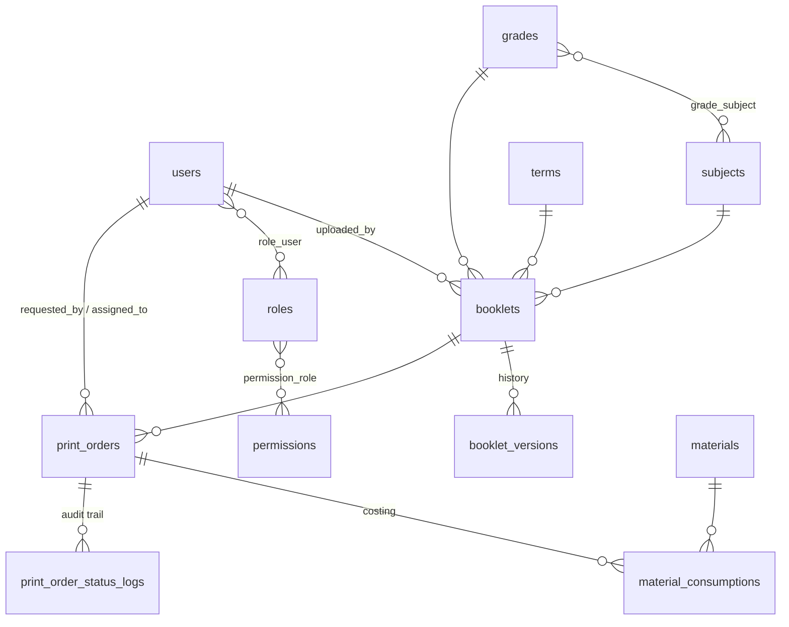

# Booklet Upload & Printing System — Database Schema

تصميم قاعدة بيانات علائقية جاهزة للإنتاج (Laravel Migrations + Eloquent Models + Seeders/Enums)
لنظام رفع وطباعة مذكرات المدرسين.

> **مستقل تماماً** عن نظام `مذكرات` المشغّل بالحاويات — انسخ هذا المجلد داخل مشروع Laravel جديد.

```
schema-design/
├── app/Enums/        # OrderStatus, ColorMode, PaperSize, BindingType, MaterialUnit
├── app/Models/       # 12 موديل مع كل العلاقات
├── database/
│   ├── migrations/   # 5 ملفات مرتّبة حسب التبعية (FK/Index/Unique/SoftDeletes)
│   └── seeders/      # الأدوار والصلاحيات + الأكاديمي + المواد
└── README.md
```

---

## مخطّط العلاقات (ERD)



---

## الجداول والمفاتيح

| الجدول | مفاتيح أجنبية (سياسة الحذف) | Unique / Index | SoftDeletes |
|--------|-----------------------------|----------------|:-----------:|
| **users** | — | `phone` unique, `email` unique, idx `is_active` | ✅ |
| **roles** | — | `name` unique | — |
| **permissions** | — | `name` unique, idx `group` | — |
| **permission_role** | `permission_id`, `role_id` → **cascade** | PK مركّب | — |
| **role_user** | `role_id`, `user_id` → **cascade** | PK مركّب | — |
| **grades** | — | `name` unique, idx `level` | ✅ |
| **subjects** | — | `name` unique, `code` unique | ✅ |
| **grade_subject** | `grade_id`, `subject_id` → **cascade** | PK مركّب | — |
| **terms** | — | unique(`name`,`academic_year`) | ✅ |
| **booklets** | `uploaded_by`,`subject_id`,`grade_id` → **restrict** · `term_id` → **set null** | idx(grade,subject,term), idx status | ✅ |
| **booklet_versions** | `booklet_id` → **cascade** · `uploaded_by` → **set null** | unique(booklet,version) | — |
| **materials** | — | `name` unique, `sku` unique | ✅ |
| **print_orders** | `booklet_id`,`requested_by` → **restrict** · `assigned_to` → **set null** | `order_number` unique, idx(status,created_at) | ✅ |
| **material_consumptions** | `print_order_id` → **cascade** · `material_id` → **restrict** | idx(order,material) | — |
| **print_order_status_logs** | `print_order_id` → **cascade** · `changed_by` → **set null** | idx(order,created_at) | — |

**منطق سياسات الحذف:**
- **restrict** على العناصر المرجعية (مدرس/مادة/صف/مذكرة) — لا يمكن حذف عنصر مستخدَم فعلياً؛ استخدم SoftDeletes بدلاً منه.
- **cascade** على البيانات التابعة (الإصدارات، الاستهلاك، سجلّ الحالات، المحاور).
- **set null** على الروابط الاختيارية (الفصل الدراسي، المشغّل المُسنَد، مُنفّذ التغيير).

---

## أنواع الـ Enums

| Enum | القيم |
|------|-------|
| `OrderStatus` | pending · in_printing · completed · delivered · cancelled (+ آلة حالات `canTransitionTo`) |
| `ColorMode` | color · bw |
| `PaperSize` | A3 · A4 · A5 · letter |
| `BindingType` | none · staple · spiral · glue · hardcover |
| `MaterialUnit` | sheet · ml · gram · piece · roll |

الحقول مخزّنة كـ `string` (متوافقة مع MySQL و PostgreSQL) وتُقرأ كـ **Backed Enums** عبر الـ casts.

---

## الأدوار والصلاحيات (RBAC)

- **admin** / **manager (Makroum Reda)** → كل الصلاحيات.
- **teacher** → `booklets.view/create/update` + `orders.view`.
- **print_operator** → `orders.view/update_status/assign/collect_cash` + `materials.view`.

مستخدم ← عدة أدوار (`role_user`) ← عدة صلاحيات (`permission_role`). مساعدات في `User`: `hasRole()` و `hasPermission()`.

---

## التشغيل

```bash
# انسخ app/ و database/ داخل مشروع Laravel، ثم:
composer require laravel/sanctum
php artisan migrate --seed
```

**ملاحظات إنتاجية:**
- التسعير: `unit_cost`/`total_cost` على الأمر، والمتبقّي `balance_due` خاصية محسوبة (لا عمود) لتجنّب عدم التزامن.
- التكلفة الفعلية للمواد تُجمَع من `material_consumptions` (بسعر الوحدة وقت الاستهلاك).
- كل تغيير حالة يُسجَّل في `print_order_status_logs` (Audit Trail).
- ملفات المذكرات تُخزَّن في قرص خاص (`storage/app/private`) والمسار مخفي عبر `$hidden`.
